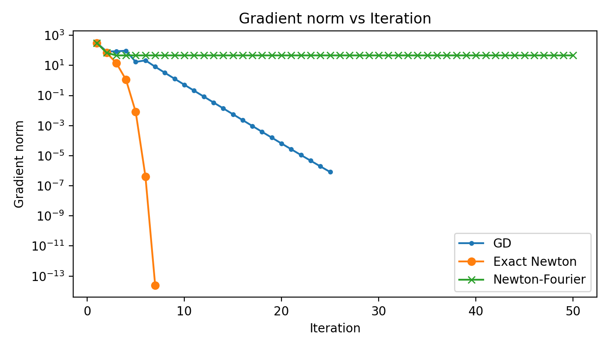
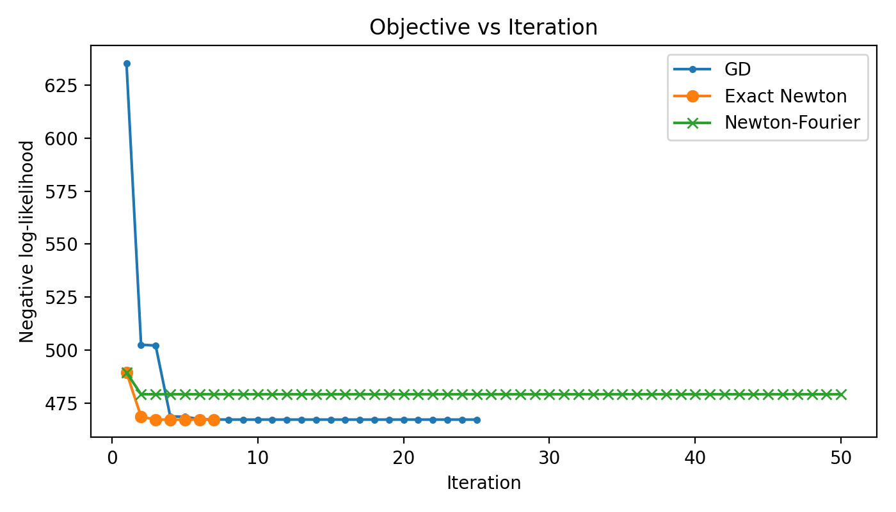

# Modification of existing numerical optimization methods in the application of logistic regression

Numerical optimization methods are widely used in regression models in finding the coefficients, as it fits well with matrices and therefore can handle cases for large number of variables. In addition to that, the iterative nature of numerical optimization allows computations to weave in. However, there exists limitations for each and every single optimization method. In logistic regression, is there a way of coming up with a new method, that makes the iterative process more efficient?

Click to download the document explaining the background: [Download the document (PDF)](../assets/bg_250831.pdf)

My attempts:

The Newton Optimization Method relies on the quadratic approximation revealed by Taylor Expansion. My first idea is to replace Taylor with the Fourier series.

Click to download the document for the Newton-Fourier method [Newton-Fourier Method (PDF)](../assets/algorithms_250901.pdf) and the explanations for the document [Newton-Fourier Method explained](../assets/algorithms_250901.pdf)

The results are as follows:

